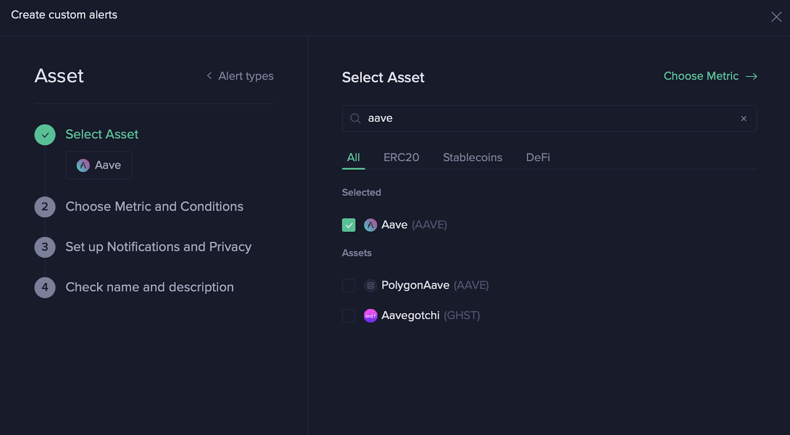
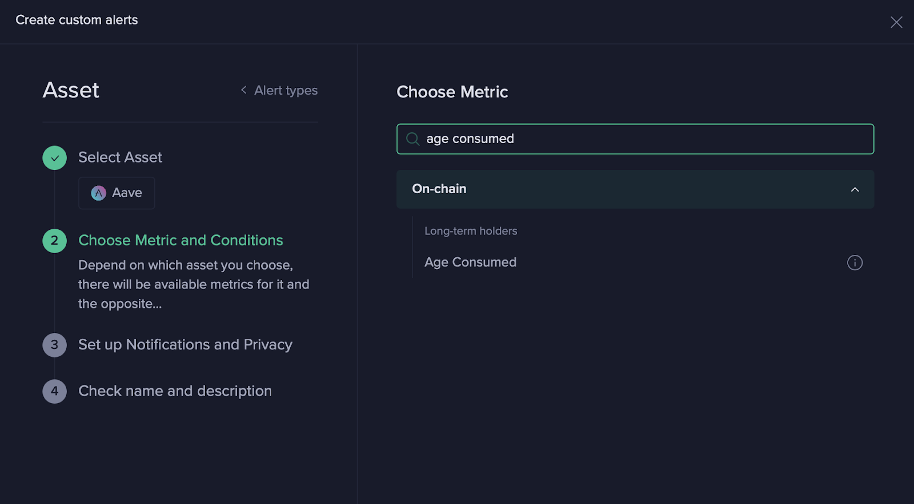
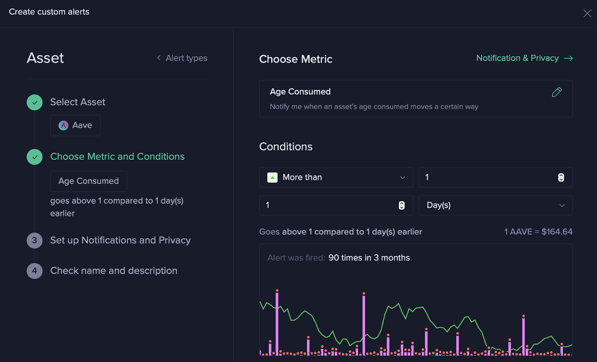

Alerts are a powerful tool that will help you keep your attention where it is most important.
With an overwhelming number of metrics available on Sanbase and an even bigger number of crypto assets on the market, it may become troublesome to keep track of every single daily change, which however may be essential if you want to not only watch the market but to be ahead of the game.

Creating a very specific alert based on your own vision will guarantee you will stay in charge of your crypto strategy.

Let’s take a look at some of the possible ways for you to work with Alerts. 

# Setting up an Age Consumed Alert

Token Age Consumed metric tracks the activity of coins based on how long they’ve stayed in their current wallets. Spikes on the chart indicate the movement of previously idle coins, i.e. those owned by long term HODLers or even ICO investors.

As usual, an unusual spike In itself may not lead to any imminent change, however in some cases it may be seen as a short term indicator that the market is acting differently. A user is therefore alerted to manually check if this is dangerous/relevant to their position using all tools available.  

Take a look at the chart below. If AAVE is an asset you are interested in, then - potentially - you could have been triggered on multiple occasions in the past 6 months. It appears that the spikes have been followed by a steady price decrease.

Let’s see how you could set this alert up. 

## Step 1

## Step 2

## Step 3

Choosing the right conditions. Now this part is tricky and is the most important step in the set up. To ensure you don't get too much noise or even false triggers it is highly advised that you carefully explore which change in the market is crucial for YOU.

Let’s see how we could do it for AAVE Age Consumed alerts. 

### Step 3b

Even though a 100% increase may seem like a strong change - take a look at the chart. It happened almost every week in the past 6 months. You probably dont want to be notified about something that appears to be a regular occurrence.

### Step 3c

If you keep on adjusting the metric you will see how now it makes more sense. Only a few significant spikes in the given period, indicating something must have really been up. 

These activities really stand out and are likely to be worth your attention.

## Step 4

Set up your notifications preferred method and you are done!

