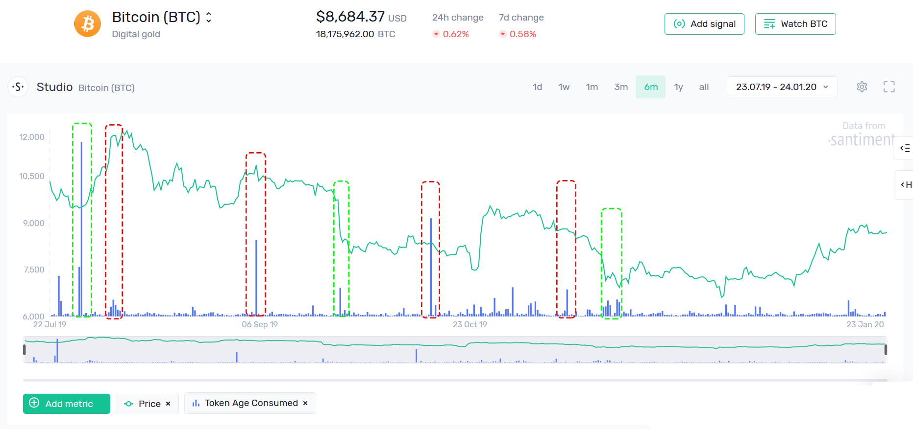
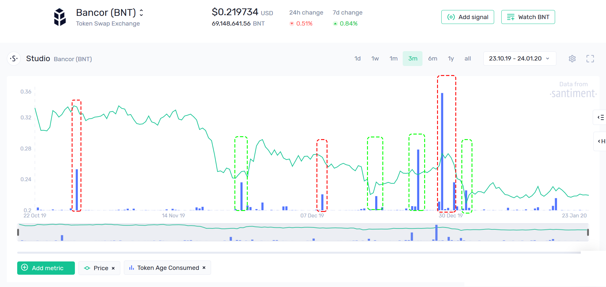
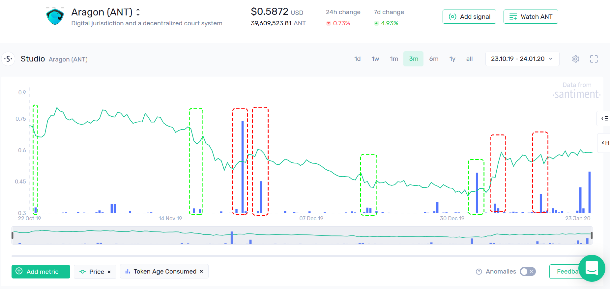

**Token Age Consumed** (TAC for short) is one of the most reliable on-chain indicators of major changes in market conditions.

In this metric, coins that have been HODLed for longer are valued more than coins that were only acquired in the past few days or weeks (often by weak hands and ‘new money’).

As a result, Spikes on the Token Age Consumed (TAC) chart signal the movement of tokens that have been idle for a long time.

The premise is that long-term HODLers and veteran traders rarely make rash decisions, and execute most trades based on extensive analysis and intimate market knowledge.

For this reason, it can be **very valuable** to know when they start moving their bags.

These events can often add volatility to the token’s short-term price action. Whether that’s “up” or “down” volatility is unique to each case, but a TAC spike is always a nudge to pay attention.

Just look at Bitcoin’s Token Age Consumed chart for the past 6 months. Nearly every major blimp came at either signalled an imminent correction (red), or came at the very bottom of the rally (green):

Here’s the same pattern observed in an altcoin: all of Bancor’s (BNT) recent spikes in Token Age Consumed either correlated with rising downward pressure (red) or signalled a bounceback (green):

One more for good measure - here’s Aragon’s Token Age Consumed chart, correlating squarely with major changes in price action:

From a fundamental perspective, spikes in Token Age Consumed are one of the most reliable volatility markers in crypto. When a lot of ‘old money’ begins to move, there’s nearly always a good reason for it. Whatever it is - you want to know when it happens.
