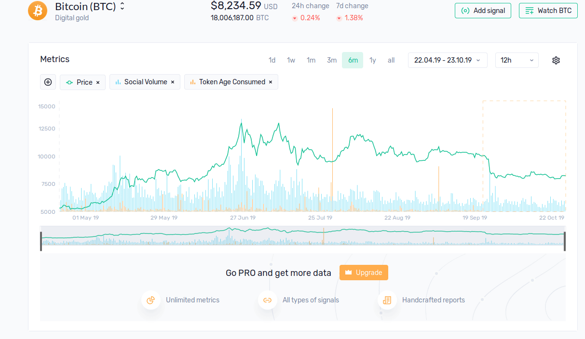

## Canonical name
`daily_active_addresses`

## Definition

The number of distinct addresses that participated in a transfer for
the given asset in any given day. Each
address is counted only once for the day. Both the senders and the
receivers of the asset are counted.

## Measuring Unit

Addresses

## Frequency - Daily

One value is computed for each day and each asset. The day is taken
according to the UTC timezone. So for example the value of the metric
for BTC and June 10, 2019 will contain the number of distinct
addresses for transfers that happened between 2019-06-10 00:00:00 UTC
and 2019-06-10 23:59:59 UTC.

## Computation time

The computation starts around 00:30 UTC each day. The final value of
this metric is generally available around 00:40 UTC.

We also compute intermediate values. That means the number of
addresses from the start of the day in UTC until the time the
computation is ran. The intermediate computations start at 06:30 UTC,
12:30 UTC, 18:30 UTC. The intermediate values are generally available
around 10 minutes after the computation starts.

*Note:* Since our Bitcoin latency is generally larger than 30 minutes
and can go up to 2 hours, the value computed at 00:30 UTC might not be
final. In that case the value computed at 6:30 UTC will be final.

## Latency

For most assets latency is around 40 minutes. For Bitcoin the latency
for the final value is usually 6 hours and 40 minutes. At 00:40 UTC
you will get an approximate value which will exclude the addresses in
the last up to 3 blocks.

## Available assets

This metric is computed for Bitcoin, Ethereum, EOS, Ripple and all
ERC20 tokens.

## How to access

### [Sandata](https://data.santiment.net?utm_source=docs)

You can access the metric on the [On-chain metrics
V2](https://data.santiment.net/d/iYmn0EGZk/00-on-chain-metrics-v2?utm_source=docs)
dashboard.

### [Sanbase](https://app.santiment.net?utm_source=docs)

The metric is available on [Sanbase](https://app.santiment.net/?enabledViewOnlySharing=true&from=2019-04-20T21%3A00%3A00.000Z&interval=12h&isShowAnomalies=true&metrics=dailyActiveAddresses&projectId=1538&scale=time&slug=bitcoin&timeRange=6m&title=Bitcoin%20%28BTC%29&to=2019-10-21T21%3A00%3A00.000Z).



### [SanAPI](https://neuro.santiment.net/)

The metric is available on SanAPI:

```js
{
  getMetric(metric:"daily_active_addresses") {
    timeseriesData(slug:"bitcoin", from:"2019-01-01T00:00:00Z", to:"2019-09-01T00:00:00Z",
    interval:"1d") {
      datetime
      value
    }
  }
}

```

[Run in explorer](https://api.santiment.net/graphiql?query=%7B%0A%20%20getMetric(metric%3A%22daily_active_addresses%22)%20%7B%0A%20%20%20%20timeseriesData(slug%3A%22bitcoin%22%2C%20from%3A%222019-01-01T00%3A00%3A00Z%22%2C%20to%3A%222019-09-01T00%3A00%3A00Z%22%2C%0A%20%20%20%20interval%3A%221d%22)%20%7B%0A%20%20%20%20%20%20datetime%0A%20%20%20%20%20%20value%0A%20%20%20%20%7D%0A%20%20%7D%0A%7D&variables=)

### [Sansheets](https://santiment.net/sansheets/)

You can use `SAN_ACTIVE_ADDRESSES` function to get the data. Example:

```
=SAN_ACTIVE_ADDRESSES("bitcoin","2019-01-01","2019-09-01")
```

## Availability

||Free|Basic|Pro|Premium|Enterprise|
|---|---|---|---|---|---|
|Sanbase|:white_check_mark:|:white_check_mark:|:white_check_mark:|:white_check_mark:|:white_check_mark:|
|Sandata|:x:|:white_check_mark:|:white_check_mark:|:white_check_mark:|:white_check_mark:|
|SanAPI|:white_check_mark:|:white_check_mark:|:white_check_mark:|:white_check_mark:|:white_check_mark:|
|Sansheets|:white_check_mark:|:white_check_mark:|:white_check_mark:|:white_check_mark:|:white_check_mark:|
