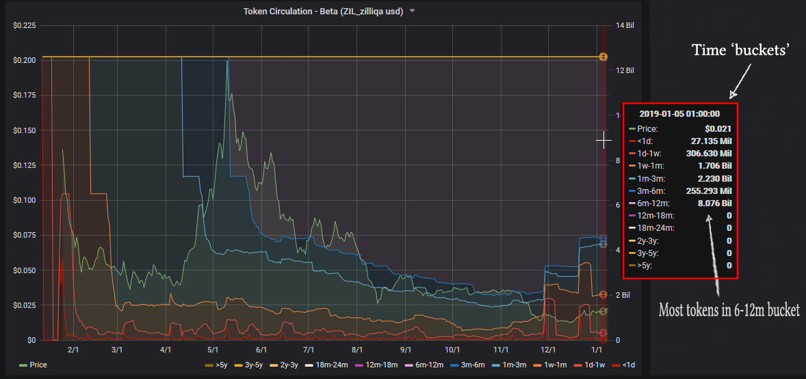
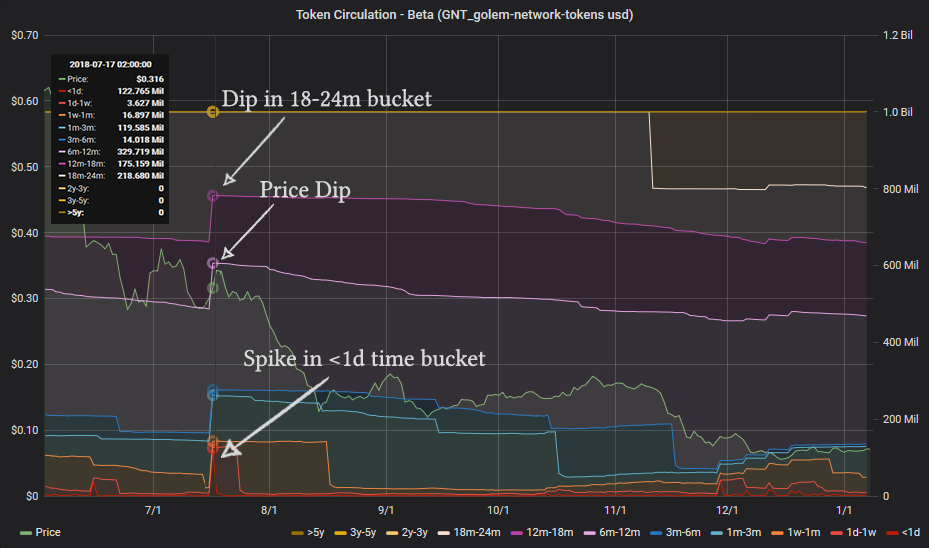
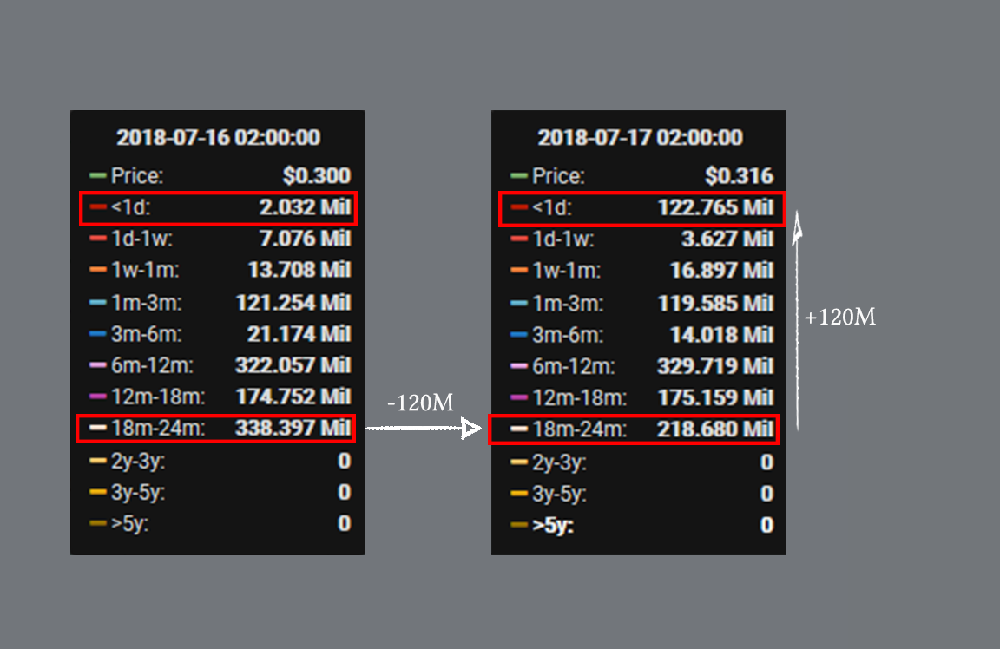

Token Circulation shows the spread of idle tokens over time. In other words, this graph indicates **how many tokens are being hodled, and for how long**, on a particular date.

The Token Circulation graph might seem overly complicated at first, but don't fret! It's actually pretty simple:

1. The green line shows the token price.
2. Other colors show the # of tokens that last moved in specific
   'buckets' of time:

**Dark Red (<1d)** = tokens that moved in the last 24hrs (basically
daily token circulation)

**Maroon (1d-1w)** = tokens that last moved between 1 day and 1 week

**Orange (1w-1m)** = tokens that last moved between 1 week and 1 month

...and so on.

For example, here's the Token Circulation graph for [Zilliqa](https://zilliqa.com/), starting from the project launch in January 2018, until January 2019:



Notice how all tokens, naturally, start off in **dark red (<1d)**, and eventually move to other 'time buckets'.

You can see the biggest share of Ziliqa tokens are currently colored **light purple (6-12m)**, meaning they haven't moved between 6-12 months (many of them likely from the project launch.)

How can you use Token Circulation?

Token circulation can be used to track large amounts of tokens moving after being idle for some time. One potential use case can be identifying when big market players exit the project post ICO.

For example, here's a Token Circulation graph for Golem (GNT), from June 2018 till now:



We can spot a curious event on July 17th, 2018, which correlated with a huge price dip from which Golem never really recovered.

On that day, there was a spike in the **dark red (<1d)** time bucket, meaning that certain tokens have gone from 'idle' to 'active'. There was a corresponding dip in the top, **pale yellow (18m-24m)** bucket, indicating those are the tokens that moved.

We can confirm this by analyzing the differences in time buckets on July 16th and July 17th:



As we can see, around 120 million GNT that were idle between 18 and 24 months (many since the project launch) have moved on June 17th (and have therefore now entered the <1d bucket). This might indicate a large early investor selling their tokens, which commonly results in a
parallel price decline.

### SanAPI

Gets the total amount of tokens that have been sent at least once during each day for given time period. Projects are referred to by a unique identifier (slug).
This metric is calculated daily, so the interval should be selected accordingly.

```graphql
{
  getMetric(metric: "circulation_1d") {
    timeseriesData(
      slug: "santiment"
      from: "2020-01-01T00:00:00Z"
      to: "2020-01-07T00:00:00Z"
      interval: "1d"
    ) {
      datetime
      value
    }
  }
}
```

**[Run in Explorer](<https://api.santiment.net/graphiql?variables=&query=%7B%0A%20%20getMetric(metric%3A%20%22circulation_1d%22)%20%7B%0A%20%20%20%20timeseriesData(%0A%20%20%20%20%20%20slug%3A%20%22santiment%22%0A%20%20%20%20%20%20from%3A%20%222020-01-01T00%3A00%3A00Z%22%0A%20%20%20%20%20%20to%3A%20%222020-01-07T00%3A00%3A00Z%22%0A%20%20%20%20%20%20interval%3A%20%221d%22)%20%7B%0A%20%20%20%20%20%20%20%20datetime%0A%20%20%20%20%20%20%20%20value%0A%20%20%20%20%7D%0A%20%20%7D%0A%7D%0A>)**

Without any suffixes like \_1d, the metric returns the number of coins/tokens ever seen up until now, which is equal to the total supply at that datetime.

```graphql
{
  getMetric(metric: "circulation_1d") {
    timeseriesData(
      slug: "santiment"
      from: "2020-01-01T00:00:00Z"
      to: "2020-01-07T00:00:00Z"
      interval: "1d"
    ) {
      datetime
      value
    }
  }
}
```

**[Run in Explorer](<https://api.santiment.net/graphiql?variables=&query=%7B%0A%20%20getMetric(metric%3A%20%22circulation%22)%20%7B%0A%20%20%20%20timeseriesData(%0A%20%20%20%20%20%20slug%3A%20%22santiment%22%0A%20%20%20%20%20%20from%3A%20%222020-01-01T00%3A00%3A00Z%22%0A%20%20%20%20%20%20to%3A%20%222020-01-07T00%3A00%3A00Z%22%0A%20%20%20%20%20%20interval%3A%20%221d%22)%20%7B%0A%20%20%20%20%20%20%20%20datetime%0A%20%20%20%20%20%20%20%20value%0A%20%20%20%20%7D%0A%20%20%7D%0A%7D%0A>)**
