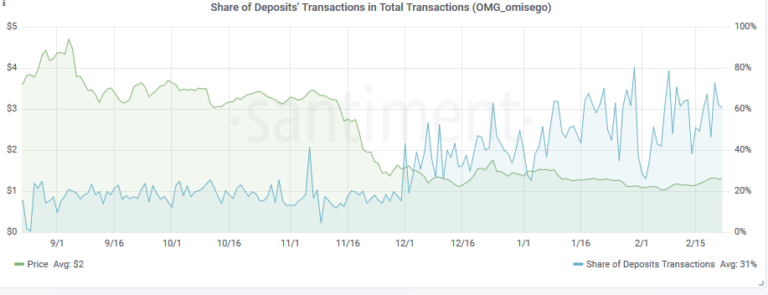

## Daily Active Deposits

Shows the **number of unique deposit addresses** that have been active on a particular day.

As an example, let's look at the DAD metric for REP, Augur's native coin. REP's price is in green, while Daily Active Deposits are colored blue.

[](https://santiment.net/wp-content/uploads/2019/02/dad-augur-2.png)

The first thing we can see is a more-less stable DAD spread over the past 6 month. On average, 43 deposit addresses were active on the Augur network each day.

Compared to other ERC-20 tokens, that's not a bad tally. For example, over the same time period, SONM recorded an average of 10 DAD, while SNT (Status) had 27, despite it being one of the most actively developed ERC-20 projects.

In contrast, OMG -- one of the most active tokens on the Ethereum network -- boasts an average of 110 DAD.

### SanAPI

This metric is calculated daily, so the interval should represent whole days.

Grouping by intervals bigger than 1 day works by taking the average of all daily results the interval.

```graphql
{
  getMetric(metric: "active_deposits") {
    timeseriesData(
      slug: "maker"
      from: "2019-05-09T11:25:04.894Z"
      to: "2019-06-23T11:25:04.894Z"
      interval: "1d"
    ) {
      datetime
      value
    }
  }
}
```

[**Run in explorer**](<https://api.santiment.net/graphiql?query=%7B%0A%20%20getMetric(metric%3A%20%22active_deposits%22)%20%7B%0A%20%20%20%20timeseriesData(%0A%20%20%20%20%20%20slug%3A%20%22maker%22%0A%20%20%20%20%20%20from%3A%20%222019-05-09T11%3A25%3A04.894Z%22%0A%20%20%20%20%20%20to%3A%20%222019-06-23T11%3A25%3A04.894Z%22%0A%20%20%20%20%20%20interval%3A%20%221d%22)%20%7B%0A%20%20%20%20%20%20%20%20datetime%0A%20%20%20%20%20%20%20%20value%0A%20%20%20%20%7D%0A%20%20%7D%0A%7D%0A>)

## Deposit-related Transactions

Shows the total number of all **incoming and outcoming transactions** involving deposit addresses on a particular day.

As such, this metric accounts for both user-to-exchange transactions:

1. from a personal wallet to a deposit address, and
2. from a deposit address to the main exchange wallet.

Deposit-related Transactions is often valuable when used in conjunction
with **Exchange Inflow** -- [another one of our
metrics](/metrics/exchange-flow-metrics)
-- which shows the total amount of coins moving to exchange wallets on a
particular day.

So, for example, an **increase in exchange inflow** but a **plateauing
number of deposit-related transactions** means that more coins are
entering the exchanges, although the number of transactions to the
exchanges stayed the same. In other words, **the average deposit size
has increased.**

As another use-case of this metric, let's take a look what
Deposit-related Transactions can tell us about MKR's popularity over
time:

[](https://santiment.net/wp-content/uploads/2019/02/maker.png)

The Transaction graph clearly shows a steady increase in the total
number of deposit-related transactions -- **especially** in the past few
weeks. In other words, the speculative interest in Maker seems to be
blooming.

It's also noteworthy that the Transaction Number metric really started
breaking out in Autumn, coinciding with Maker's surge in popularity.

## Share of Deposit-related Transactions on Total Transactions

The SDT metric shows the share of deposit-related transactions in the
total number of transactions on a network.

The main goal remains to measure the level of speculative interest in a
coin -- but from another perspective.

**SDT** is particularly useful when combined with **Daily Active
Deposits** and their **share in total daily active addresses (SDD).**

For example, it could be the case that a relatively small number of
deposit addresses generates a **disproportionately large**amount of
transactions on the network. Or vice versa -- a large number of deposit
addresses generate a relatively small amount of network transactions,
indicating that a token is used predominantly for its utility.

The former seems to be the case with REP. If we look at Augur over the
last 6 months, we'd find just **30% of deposit addresses** (on average)
responsible for **50% of all network transactions:**

[](https://santiment.net/wp-content/uploads/2019/02/SAD-augur.png)

_Share of daily active deposits in DAA over the last 6 months (SDD)
=30%_

[](https://santiment.net/wp-content/uploads/2019/02/sdt.png)

_Share of Deposit-related transactions over the last 6 months = 50%_

We see another peculiar case in the case of OmiseGo, where the number of
daily active deposits over the last 6 months stayed the same, but the
share of deposit-related transactions significantly increased. This
means that non-deposit addresses now account for comparatively less
transactions, which may indicate a **steady rise of speculative
interest** in the OMG network:

[](https://santiment.net/wp-content/uploads/2019/02/dad-omg.png)

_A steady number of Daily Active Deposits over the last 6 months (minus
that huge spike)_

[](https://santiment.net/wp-content/uploads/2019/02/sdt-omg.png)

_A gradual increase in share of deposit-related transactions over the
last 6 months_
