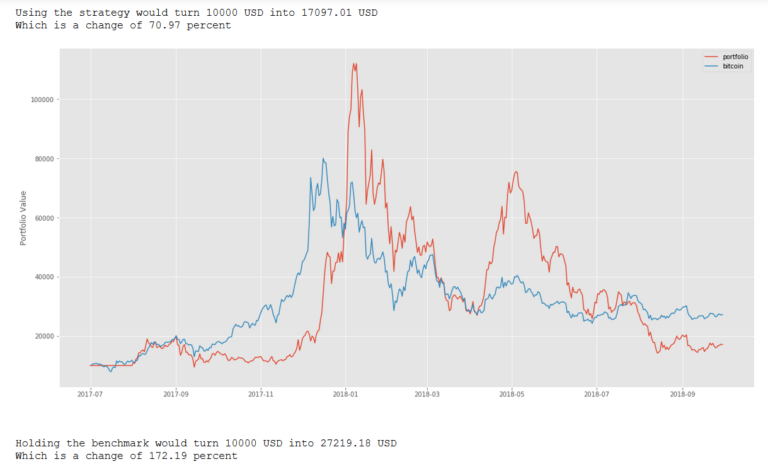

## Definition

The development activity of a project done in its public github repositories.

A developer's time is a relatively expensive resource (especially in crypto), so
high development activity implies that:

1. The project is serious about its business proposition
2. The project will likely ship new features in the future
3. It's less likely that the project is just an exit scam

Simply put, Development Activity can be used to gauge a project's commitment to
creating a working product, and continuously polishing and upgrading its
features.

> **Note:** Only development work done in public github repositories can be tracked.
> Work done in private/unknown repositories or public repositories outside
> github won't be counted.

---

## Access

[Free Access](/metrics/details/access#free-access)

---

## Measuring Unit

Development Activity metrics are measured in number of events.

When developers work they encapsulate their code changes in commits. When a
repository page [like this](https://github.com/santiment/sanbase2) is opened in
github one of the first things shown is the number of commits.


One naturally would think that counting commits is an accurate approximation of
development activity. A lot of the data aggregators track the number of Github
commits, an unfortunate solution that returns skewed data.

Why skewed?

There are a lot of projects that 'fork' (copy everything up until this moment)
other blockchains' source code and make small changes on top of it. The process
of forking inherits all commits, but that are other people's commits. This is
not work done by the team that makes the fork. In this case pure commit counting
would result in high dev activity of the forking party, too.

We measure dev activity in a different way.

At Santiment, we implemented a more reliable approach -- tracking the number of
Github events that the project generates. Pushing a commit generates an event,
but there are also many other activities that generate an event:

- Creating an Issue
- Creating a Pull Request
- Commenting an issue/Pull Request
- Forking/starring/watching a repository
- many others.

Our custom method dramatically improves both accuracy and serviceability of
Github data. The reason is that the process of forking a repository generates
just a single `ForkEvent` instead creating an event for every commit that gets
inherited.

At the time of writing this the [bitcoin](https://github.com/bitcoin/bitcoin)
repository has around 23.4k commits and [Bitoin
SV](https://github.com/bitcoin-sv/bitcoin-sv) repository has around 15.8k
commits. Let's take a look at the events counting approach:

Bitcoin: 

Bitcoin SV: 

We observe that Bitcoin has a high development activity all the time with the
highest value reaching 98. Meanwhile Bitcoin SV has 0 dev activity most of the
time with a spike of just 1.4.

If you want to learn more about the difference - and the benefits of our bespoke
approach - I highly suggest [this
piece](https://medium.com/santiment/tracking-github-activity-of-crypto-projects-introducing-a-better-approach-9fb1af3f1c32)
by Valentin, our CTO.

---

## Data Type

[Timeseries Data](/metrics/details/data-type#timeseries-data)

---

## Change Metrics

[Change Metrics](/metrics/details/change_metrics)

---

## Frequency

[Five-Minute Intervals](/metrics/details/frequency#five-minute-frequency)

---

## Latency

[Development Activity Data Latency](/metrics/details/latency#development-activity-latency)

---

## Development Activity Metric

The 'pure' development activity. It excludes events that are not development
related like:

- Comments on issues
- Issues created and closed
- Creating of forks
- Comments on commits
- People following an issue
- Downloading releases
- Watching a repository
- Project management events

This allows to better compare projects that use github for issue tracking and
projects that do not use github for issue tracking. If such events are not
excluded then the second project could have inflated activity just by discussion
what they are going to build without actually building it.

- Available For - [All assets with known github
  organization](<https://api.santiment.net/graphiql?variables=&query=%7B%0A%20%20getMetric(metric%3A%20%22dev_activity%22)%7B%0A%20%20%20%20metadata%7B%0A%20%20%20%20%20%20availableSlugs%0A%20%20%20%20%7D%0A%20%20%7D%0A%7D>)
- Latency - From 1 to 6 hours
- Min Interval - 5 minutes
- Access - free

[Run in
Explorer](<https://api.santiment.net/graphiql?variables=&query=%7B%0A%20%20getMetric(metric%3A%20%22dev_activity%22)%7B%0A%20%20%20%20timeseriesData(%0A%20%20%20%20%20%20slug%3A%20%22ethereum%22%0A%20%20%20%20%20%20from%3A%20%222020-02-10T07%3A00%3A00Z%22%0A%20%20%20%20%20%20to%3A%20%222020-03-10T07%3A00%3A00Z%22%0A%20%20%20%20%20%20interval%3A%20%221w%22)%7B%0A%20%20%20%20%20%20%20%20datetime%0A%20%20%20%20%20%20%20%20value%0A%20%20%20%20%20%20%7D%0A%20%20%7D%0A%7D>)

---

## Github Activity Metric

The total github activity - it counts all events. It is always equal or bigger
than the dev activity.

- Available For - [All assets with known github
  organization](<https://api.santiment.net/graphiql?variables=&query=%7B%0A%20%20getMetric(metric%3A%20%22github_activity%22)%7B%0A%20%20%20%20metadata%7B%0A%20%20%20%20%20%20availableSlugs%0A%20%20%20%20%7D%0A%20%20%7D%0A%7D>)
- Latency - From 1 to 6 hours
- Min Interval - 5 minutes
- Access - free

[Run in
Explorer](<https://api.santiment.net/graphiql?variables=&query=%7B%0A%20%20getMetric(metric%3A%20%22github_activity%22)%7B%0A%20%20%20%20timeseriesData(%0A%20%20%20%20%20%20slug%3A%20%22ethereum%22%0A%20%20%20%20%20%20from%3A%20%222020-02-10T07%3A00%3A00Z%22%0A%20%20%20%20%20%20to%3A%20%222020-03-10T07%3A00%3A00Z%22%0A%20%20%20%20%20%20interval%3A%20%221w%22)%7B%0A%20%20%20%20%20%20%20%20datetime%0A%20%20%20%20%20%20%20%20value%0A%20%20%20%20%20%20%7D%0A%20%20%7D%0A%7D>)

---

## As a Trading Strategy

While not common, Dev Activity can also be used as a novel trading strategy. A
few months back, we tested a portfolio of only the top ERC20 projects by dev
activity, refreshed each month.

We backtested the strategy from August 2017 to October 2018. [The portfolio
1](https://santiment.net/blog/github-activity-portfolio/) turned a profit, but
didn't beat hodling BTC overall.


However, our portfolio was also more volatile than hodling over time,
registering significantly larger tops in January and May of 2018. If you were to
sell at one of those intersections instead, our Github portfolio would in fact
be the winner.

As a custom metric, dev activity can help you understand a project's dedication
to its product, and in turn - its end users.

---

## Available Assets

Available for [these
assets](<https://api.santiment.net/graphiql?variables=&query=%7B%0A%20%20getMetric(metric%3A%20%22dev_activity%22)%20%7B%0A%20%20%20%20metadata%20%7B%0A%20%20%20%20%20%20availableSlugs%0A%20%20%20%20%7D%0A%20%20%7D%0A%7D%0A>)

> **Note**: All metrics are available for the same set of assets.

---

## SanAPI

The metrics are available under the `dev_activity` and `github_activity` names.

```graphql
{
  getMetric(metric: "dev_activity") {
    timeseriesData(
      slug: "santiment"
      from: "2020-01-13T00:00:00Z"
      to: "2020-01-18T00:00:00Z"
      interval: "1d"
    ) {
      datetime
      value
    }
  }
}
```

**[Run in Explorer](<https://api.santiment.net/graphiql?query=%7B%0A%20%20getMetric(metric%3A%20%22dev_activity%22)%20%7B%0A%20%20%20%20timeseriesData(%0A%20%20%20%20%20%20slug%3A%20%22santiment%22%0A%20%20%20%20%20%20from%3A%20%222020-01-13T00%3A00%3A00Z%22%0A%20%20%20%20%20%20to%3A%20%222020-01-18T00%3A00%3A00Z%22%0A%20%20%20%20%20%20interval%3A%20%221d%22)%20%7B%0A%20%20%20%20%20%20%20%20datetime%0A%20%20%20%20%20%20%20%20value%0A%20%20%20%20%7D%0A%20%20%7D%0A%7D%0A&variables=>)**

---

```graphql
{
  getMetric(metric: "github_activity") {
    timeseriesData(
      slug: "santiment"
      from: "2020-01-13T00:00:00Z"
      to: "2020-01-18T00:00:00Z"
      interval: "1d"
    ) {
      datetime
      value
    }
  }
}
```

**[Run in Explorer](<https://api.santiment.net/graphiql?query=%7B%0A%20%20getMetric(metric%3A%20%22github_activity%22)%20%7B%0A%20%20%20%20timeseriesData(%0A%20%20%20%20%20%20slug%3A%20%22santiment%22%0A%20%20%20%20%20%20from%3A%20%222020-01-13T00%3A00%3A00Z%22%0A%20%20%20%20%20%20to%3A%20%222020-01-18T00%3A00%3A00Z%22%0A%20%20%20%20%20%20interval%3A%20%221d%22)%20%7B%0A%20%20%20%20%20%20%20%20datetime%0A%20%20%20%20%20%20%20%20value%0A%20%20%20%20%7D%0A%20%20%7D%0A%7D%0A&variables=>)**
