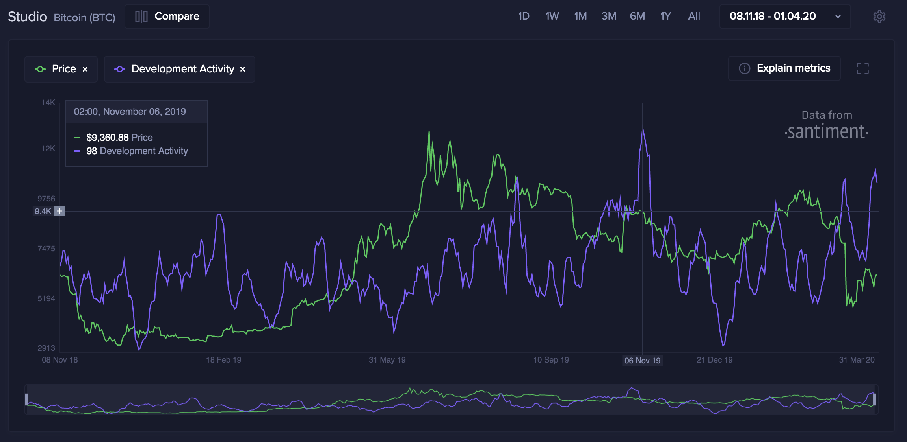
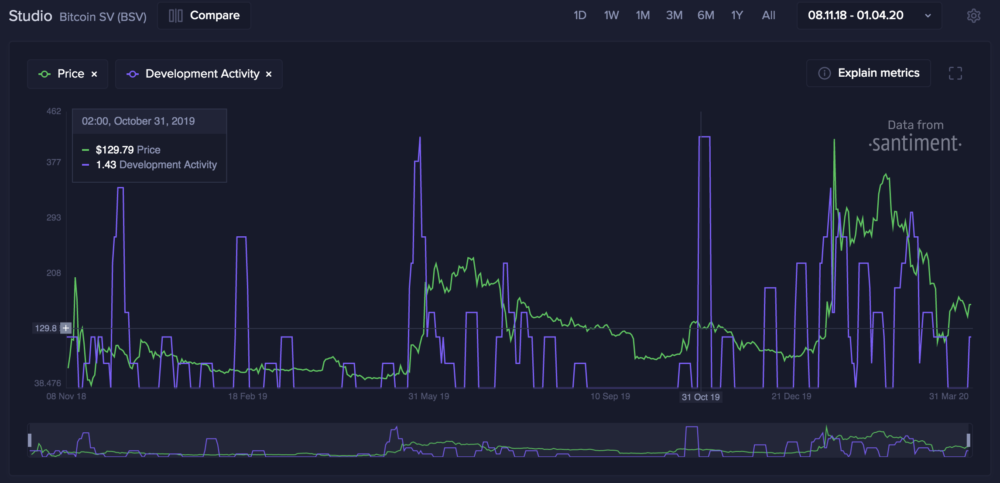

## Metrics

The development-related data allows the definition of different metrics.
These metrics include: 
- [Development Activity](/metrics/development-activity/development-activity/) - Ignore the non-development related events. Excluding this allows different projects' values to be compared. If this exclusion is not done, the projects that use Github for active issues tracking would have an unfair advantage.
- [Development Activity Contributors Count](/metrics/development-activity/development-activity-contributors-count/) - Track the number of unique development activity contributors.
- [Github Activity](/metrics/development-activity/github-activity/) - Count all events for a project.
- [Github Activity Contributors Count](/metrics/development-activity/github-activity-contributors-count) - Track the number of unique github activity contributors.

---

## Why Development Acitivty matters?

The development activity of a project that Santiment tracks is done in the project's public GitHub repositories.
The work done in private repositories cannot be tracked. In crypto, a lot of the work is done in public repositories, so this metric is available for many projects.

A developer's time is an expensive resource, so
high development activity implies that:

- The project is serious about its business proposition;
- The project will likely ship new features in the future and address existing issues;
- It's less likely that the project is just an exit scam.

Simply put, development-related metrics can be used to gauge a project's commitment to
creating a working product, and continuously polishing and upgrading its
features.

> **Note:** Only development work done in public github repositories can be tracked.
> Work done in private/unknown repositories or public repositories outside
> GitHub won't be counted.

---

## How development activity is tracked?

Development-related metrics are using the events emitted by Github. The metrics **do not** use the number of commits in a repository.

When developers work they encapsulate their code changes in commits. When a
repository page [like this](https://github.com/santiment/sanbase2) is opened in
github one of the first things shown is the number of commits.

One naturally would think that counting commits is an accurate approximation of
development activity. A lot of the data aggregators track the number of Github
commits, an unfortunate solution that returns skewed data.

Why skewed?

There are a lot of projects that 'fork' (copy everything up until this moment)
other blockchains' source code and make small changes on top of it. The process
of forking inherits all commits, but this is other people's work. This is
not work done by the team that makes the fork. In this case pure commit counting
would result in high activity of the forking party, too.

We measure development in a different way.

At Santiment, we implemented a more reliable approach $-$ tracking the number of
Github events that the project generates. Pushing a commit generates an event,
but there are also many other activities that generate an event:

- Creating an Issue
- Creating a Pull Request
- Commenting an issue/Pull Request
- Forking/starring/watching a repository
- many others.

More importantly, when a project is forked, it does not inherit any of the already emitted events. Our custom method dramatically improves both accuracy and serviceability of Github data. The reason is that the process of forking a repository generates just a single `ForkEvent` instead creating an event for every commit that gets inherited.

At the time of writing this the [bitcoin](https://github.com/bitcoin/bitcoin)
repository has around 37.7k commits and [Bitoin
SV](https://github.com/bitcoin-sv/bitcoin-sv) repository has around 18.6k
commits. Let's take a look at the events counting approach:

Bitcoin: 

Bitcoin SV: 

We observe that Bitcoin has a high development activity all the time with the
highest value reaching 98. Meanwhile Bitcoin SV has 0 dev activity most of the
time with a spike of just 1.4.

If you want to learn more about the difference - and the benefits of our bespoke
approach - I highly suggest [this
piece](https://medium.com/santiment/tracking-github-activity-of-crypto-projects-introducing-a-better-approach-9fb1af3f1c32)
by Valentin, our ex-CTO.

---

## As a Trading Strategy

While not common, Development-related metrics can also be used as a novel trading strategy. Some time ago, we tested a portfolio of only the top ERC20 projects by development activity, refreshed each month.

We backtested the strategy from August 2017 to October 2018. [The portfolio
1](https://santiment.net/blog/github-activity-portfolio/) turned a profit, but
didn't beat hodling BTC overall.

However, our portfolio was also more volatile than hodling over time,
registering significantly larger tops in January and May of 2018. If you were to
sell at one of those intersections instead, our Github portfolio would in fact
be the winner.

As a custom metric, dev activity can help you understand a project's dedication
to its product, and in turn - its end users.

---