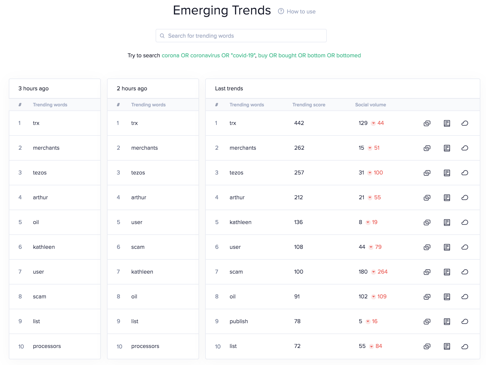

## Definition

The **Emerging trends** (or **Trending words**) is a list of words that describe
the topics which _emerged_ faster than any others over the last 24 hours. By
"emerging" we mean getting more social attraction from the crowd, being
discussed much more than any other topic.

We detect these words by computing the so called _hype score_ for each single
word that is present in the [social data](/metrics/details/social-data/) after filtering
and cleaning the data. Once this number is calculated, the words are ranked
according to the corresponding scores in a descending order. The top 10 words in
the resulting list are the top emerging trends.

---

## Access

The metric's realtime data is **free**.
The metric's historical data is with [restricted access](/metrics/details/access#restricted-access).

---

### Filtering and Cleaning

In order to reduce the level of noise, spam and duplicates while calculating the
hype scores, we apply some preprocessing to the text data, namely:

1. Clean all the texts from
   [stopwords](https://en.wikipedia.org/wiki/Stop_words) and non-alphabetic
   characters.

2. Transform each pair `(user_id, text_documents)` to a [bag of
   words](https://en.wikipedia.org/wiki/Bag-of-words_model) representation and
   remove all the bag of words duplicates.

3. For all the text documents that have more than a certain amount of words in
   general (usually 5) - remove the exact duplicates (i.e. messages that look
   exactly the same are considered only once).

These steps help to make the approach robust to spam and multiple replications
of the same word or short word combinations.

---

### Hype Score

After the processing is done, for each of the words we calculate the **hype
score** (or **trend score**). For any timestamp $t$ we define the hype score as
follows:

$$
HypeScore(t) := \frac{(v_t  ^n - \frac{1}{14} \sum_{i=t-15}^{t-1} v_i^n) * v_t^n *
\log_{10} u_t}{1 + \frac{1}{14} \sum_{i=t-15}^{t-1} v_i^n}
$$

where:

- $v_i^n$ is the _normalized_ social volume of the word at the moment $i$ (i.e.
  the usual [social volume](/metrics/social-volume-metrics/#social-volume)
  divided by the total amount of messages in that particular [data
  source](/metrics/details/social-data/)),

- $u_t$ is the total amount of unique users that have used the word under
  consideration at least once.

On an intuitive level the hype score tends to be a measuring of how rapidly the
social volume of a certain word increased over the last 24 hours in comparison
to the past 2 weeks. This is done by comparing the current social volume change
to the average social volume of the past 14 days.

Additionally we multiply this factor by `log(unique_users)` - this way words
with a high social volume and a relatively low amount of unique users, that
mentioned it at least once, will have a smaller hype score. For example, if a
given word was used many times by exactly one user (i.e. most probably it's
heavy spam) this word will have a hype score of **0** thanks to the
`log(unique_users)` component. On the other hand, words with 100 and 200 users
will have more or less the same chance to get a higher hype score.

It's also worth noticing that we use the **normalized** social volume instead of
the regular one. This makes it easier to compare the resulting hype score across
different data sources with different average daily volumes of talks.

---

### Ranking the Words

Once the texts are cleaned and each word has it's hype score, we first rank the
words in descending order (the highest hype score goes to the top) and then
combine the results across different data sources if necessary: this is done by
averaging the hype score for each word across all desired data sources and
ranking the words afterwards again. In case a given word is present in source 1
and is not present in source 2 we assume that it's hype score in the second data
source is 0.

---

## Measuring Unit

The [hype score](#hype-score) doesn't really have a qualitative meaning, it can
be treated as a relative number: the higher it gets - the faster a given word is
"emerging".

---

## Data Type

[Timeseries Data](/metrics/details/data-type#timeseries-data)

---

## Frequency

Emerging Trends are available at [hourly intervals](/metrics/details/frequency#hourly-frequency)

---

## Latency

Emerging Trends has [social data Latency](/metrics/details/latency#social-data-latency)

---

## Available Assets

The algorithm takes into account all the [social data](/metrics/details/social-data/),
so the list may or may not contain asset names and tickers. We do track the
emerging projects separately for the assets only, but currently it is not
available through any of the products.

---

## How to Access

### [Sanbase](https://app.santiment.net/labs/trends)

The emerging trends are available in the _`Labs`_ section.

### [SanAPI](https://api.santiment.net)

The emerging trends are available as part of the API, the metric is called
`getTrendingWords`:

```graphql
{
  getTrendingWords(
    from: "2020-01-01T12:00:00Z"
    to: "2020-01-01T13:00:00Z"
    size: 10
    interval: "1h"
  ) {
    datetime
    topWords {
      word
      score
    }
  }
}
```

**[Run in Explorer](<https://api.santiment.net/graphiql?variables=&query=%7B%0A%20%20getTrendingWords(from%3A%20%222020-01-01T12%3A00%3A00Z%22%2C%20to%3A%20%222020-01-01T13%3A00%3A00Z%22%2C%20size%3A10%2C%20interval%3A%221h%22)%20%7B%0A%20%20%20%20datetime%0A%20%20%20%20topWords%20%7B%0A%20%20%20%20%20%20word%0A%20%20%20%20%20%20score%0A%20%20%20%20%7D%0A%20%20%7D%0A%7D%0A>)**
