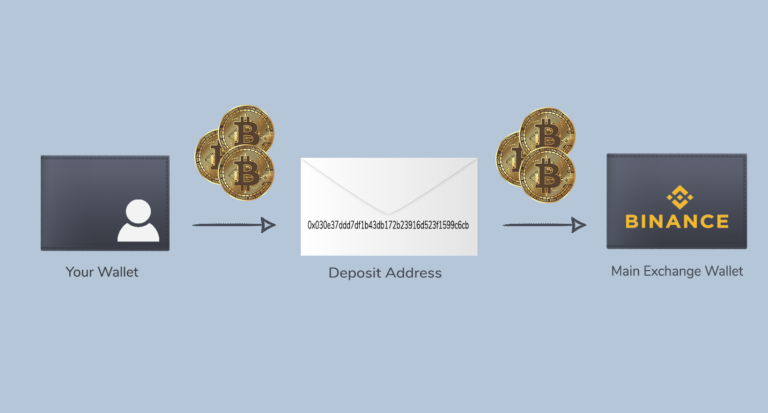

What are deposit addresses? {#what-are-deposit-addresses .intercom-align-left data-post-processed="true"}
---------------------------

When somebody wants to make a deposit to an exchange, there are two
transactions that occur:

1.  Coins move from a personal wallet to a temporary wallet, created by
    an exchange for each separate user.
2.  Coins move from that temporary wallet to the main exchange wallet.

::: {.intercom-container .intercom-align-left}

:::

We call these temporary wallets **deposit addresses**, or deposits, and
they can supply us with invaluable information about a particular
network's behavior.

Analyzing deposit addresses can prove useful in several ways:

1.  The total number of deposit addresses is a fairly reliable proxy of
    the **actual number of people** trading a particular coin on the
    exchanges.\
    The metric is not 100% accurate in this regard as a single person
    may have a variety of different deposit addresses, but it does give
    us a clear **upper limit** on the total number of users, and works
    pretty well dynamically.\
2.  Relying on network-level metrics (for example, total transaction
    volume) doesn't really tell us what goes on in different sections of
    network activity.\
    Being able to distinguish which part of total network activity was
    generated by deposit addresses lets us get a **lot more granular**
    when exploring a specific market event.\
3.  Tracking the activity of deposit addresses may help us examine and
    foresee market movement with a **new level of awareness.**

Our current metrics for deposit addresses {#our-current-metrics-for-deposit-addresses .intercom-align-left data-post-processed="true"}
-----------------------------------------

1.  Daily Active Deposits (DAD) - [article
    link](/intercom-articles/metrics-explained/sangraphs/metric-daily-active-deposits)
2.  Share of Daily Active Deposits in Total Daily Active Addresses
    (SDD) - [article
    link](/intercom-articles/metrics-explained/sangraphs/metric-share-of-daily-active-deposits-in-total-daily-active-addresses)
3.  Deposit-related Transactions - [article
    link](/intercom-articles/metrics-explained/sangraphs/metric-deposit-related-transactions)
4.  Share of Deposit-related Transactions on Total Transactions (SDT) -
    [article
    link](/intercom-articles/metrics-explained/sangraphs/metric-share-of-deposit-transactions-in-total-transactions)
