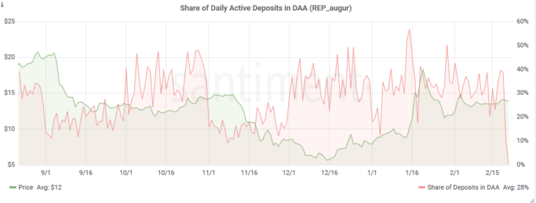

*This article mentions one of several metrics we offer regarding
exchange deposit addresses. Please check* [*this
article*](/intercom-articles/metrics-explained/sangraphs/metrics-about-deposit-addresses)
*for an introduction on deposit addresses and the complete list of
metrics offered.*

Built on top of DAD, SDD calculates the share of daily active deposits
(DAD) in the total number of daily active addresses (DAA), by dividing
the two (DAD/DAA). The results are shown in percentages for simplicity.

The idea behind this metric is to serve as a quick-glance **indicator of
the speculative interest** in a particular coin. The bigger the SDD, the
more people are using the coin for trading rather than whatever its
proposed utility, and vice versa.

It's worth keeping in mind, however, that SDD does not give us the
**full picture** in terms of an absolute speculative interest on a
network. For example, an SDD of 20% does not mean that **only 20%** of
the network activity on a given day is trade-related.

Our DAA metric, which tracks a **total number** of Daily Active
Addresses, consists of several types of addresses interacting with a
network daily:

1.  Deposit Addresses
2.  Main Exchange wallets
3.  Withdrawal Addresses
4.  Addresses that are actually using the coins for its utility

Obviously, 3 out of 4 of these (types of) addresses are trade related.
SDD, by itself, accounts only for the share of **Deposit Addresses** in
total Daily Active Addresses.

The number of main exchange wallets is more-less constant and almost
entirely inconsequential compared to the number of deposit and
withdrawal addresses.

However, when using SDD to gauge the relative speculative interest in a
coin, keep in mind that withdrawal addresses are **not** included in the
calculation, so the actual % of trade-related network activity will
usually be even higher.

That said, a spike in SDD will still undoubtedly indicate that the
speculative activity on the network is growing. On the other hand, a
drop in SDD may suggest **network maturation**, as less people use the
coin for trading and turn to its (other) purported benefits.

Compared to DAD, which can be used to examine and explain momentary
market events, Share of Daily Active Deposits is designed as more of a
long-term indicator. So far, we found it to be much more useful for a
wall-to-wall retrospective or comparative analysis.

## Examples

Let's compare the SDD for a couple of different projects:

1. 0x (ZRX)

2. Bancor (BNT)

Save for a few notable spikes, 0x has exhibited a relatively stable
share of Daily Active Deposits in DAA for the last 18 months. On
average, the network's SDD stands at 15.5% for the observed time frame.

Bancor's SDD, on the other hand, is a fair bit more volatile, ranging
from an average of 20% at the end of 2017 to just ~5% for the last 30
days. This tells us that the coin's being traded less than it used to
be, at least **relative** to the number of total daily active addresses
on the network.

This should be good news for the project, as the decline in relative
speculative interest indicates a growing maturity of the network:
nowadays, Bancor seems to be used more often for its primary (utility)
purpose.
