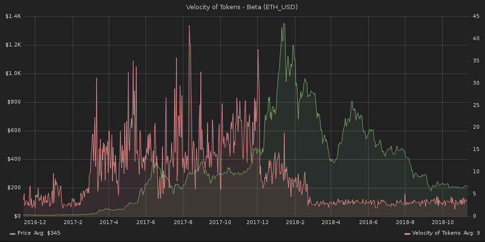

*For a more in-depth explanation of `Velocity of Tokens`, please
click*
[*here*](https://community.santiment.net/t/token-velocity-metric/412/2)*.
For a video breakdown of Transaction Volume and Token Velocity, click*
[*here*](https://drive.google.com/open?id=1fAgF96dCsl0RLosL8Fj1p-W0NXBR5onh)*.*

This graph shows the average number of times that a token changes
wallets each day.

Simply put, a higher token velocity means that a token is used in
transactions more often within a set time frame.

Token Velocity can be used to explain various noteworthy events in the
life of a project. For example, here's Ethereum:

Notice the steep drop off?

The increased activity (and subsequent dip) correlates squarely to a
huge ETH mixer that operated between March 2017 and March 2018.

Once the mixer was liquidated, token velocity toppled back to 'normal'
levels, where it's remained ever since.
