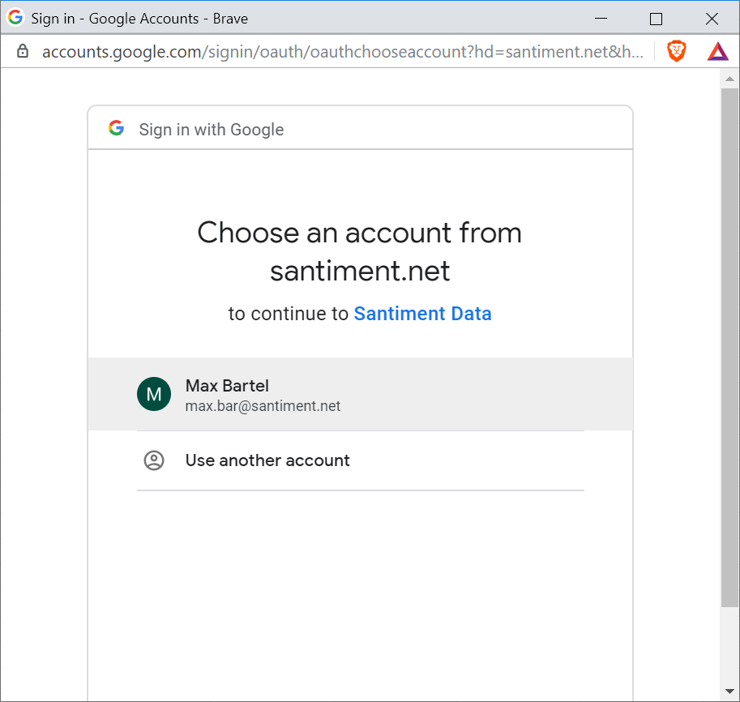
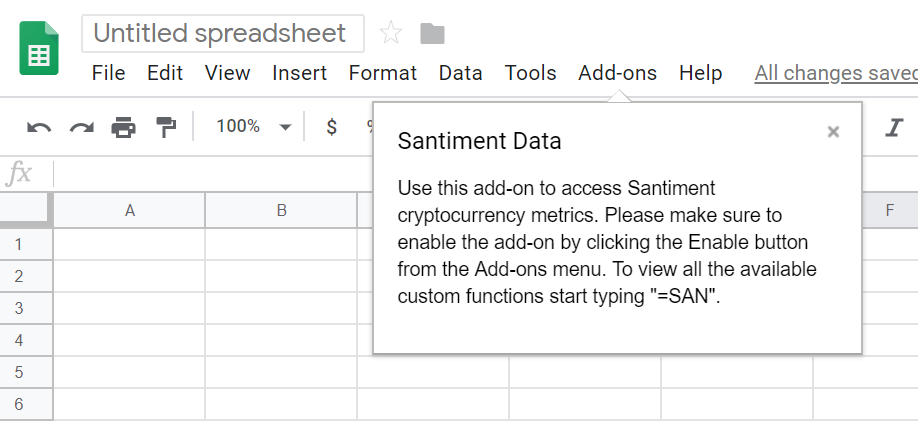

## Install Sansheets

To add Sansheets to your Google Sheets first open a spreadsheet. It can
be a fresh one. You will find the option **`Get add-ons...`** in the
top navigation under:

This will open a store-like interface for add-ons. Enter **`Santiment`** into the search bar in the upper right and hit return:

You will get **`Santiment Data`** as a result. Click on the **`+FREE`** button to install it:

You will now be asked to select the Google account you want to use. As you should be logged in already, the appropriate one should be listed.
Click it to continue:

In the next step you are asked to confirm that the Sansheets plugin is allowed to do its work:

Sansheets is now installed, which will be highlighted by an introductory tooltip:

## Enabling Sansheets for the spreadsheet

To activate Sansheets in the currently opened document, select it in the **`Add-ons`** menu, where you will find **`Enable`**:

Sansheets will take a second to activate and let you know as soon as it's ready:

## Getting access to more data

To make full use of Sansheets, you will want to use an API key eventually. Find out [here](/general/products-and-plans/create-an-api-key) how to create one and [here](/sansheets/getting-started/adding-an-api-key) how to add it to Sansheets.
