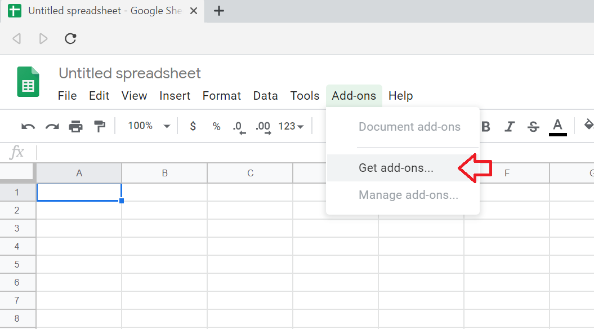
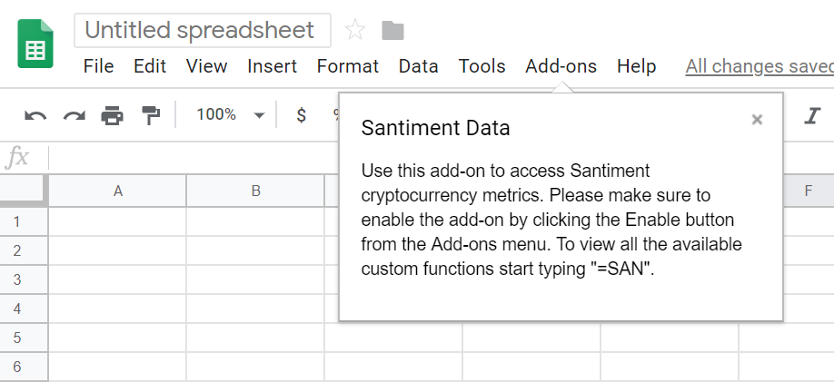
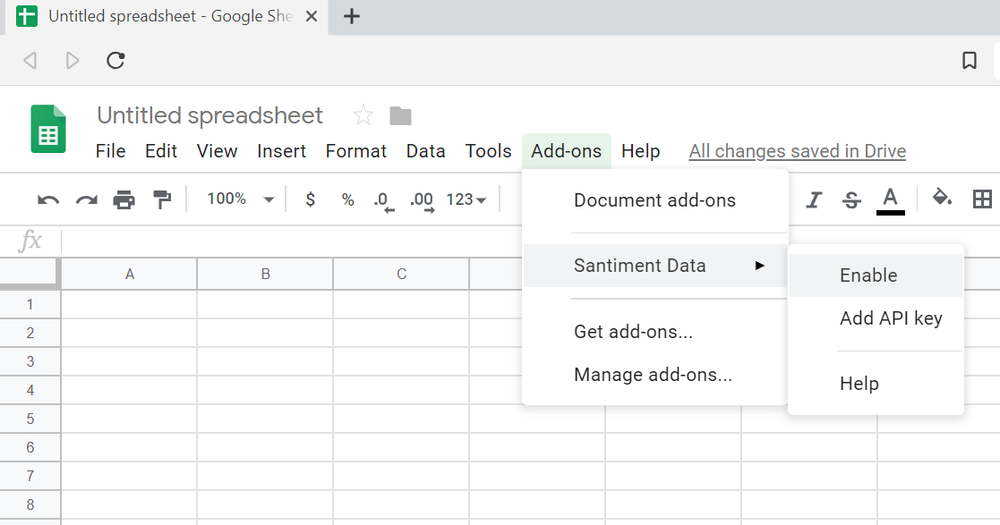
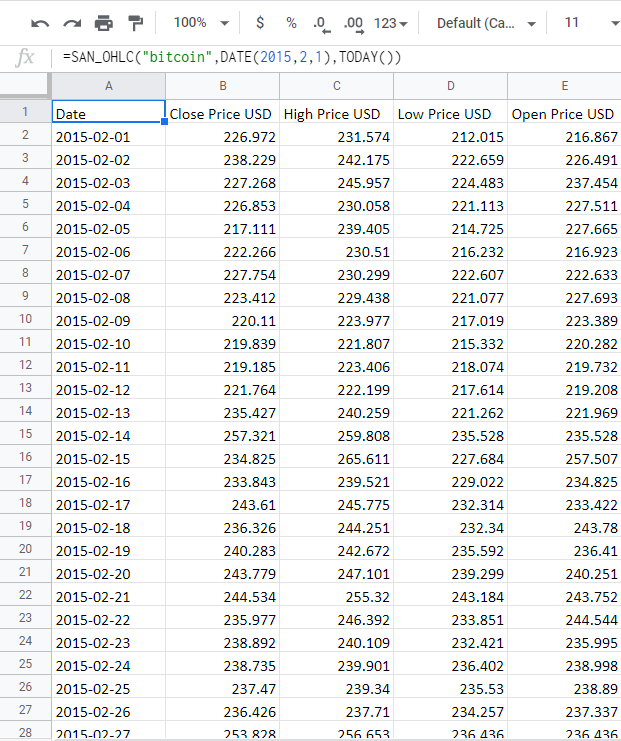
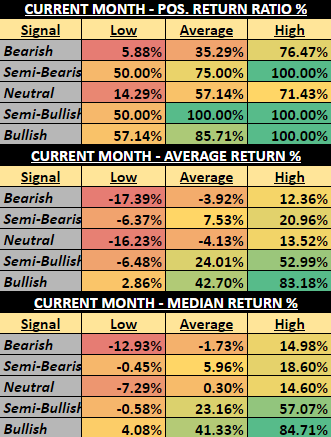
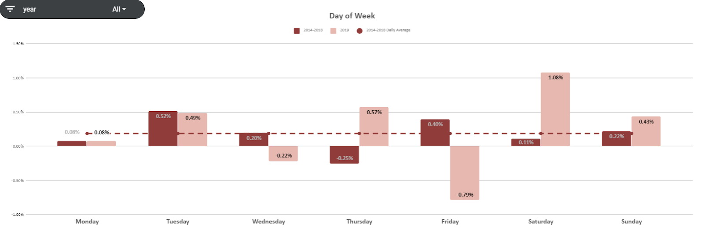
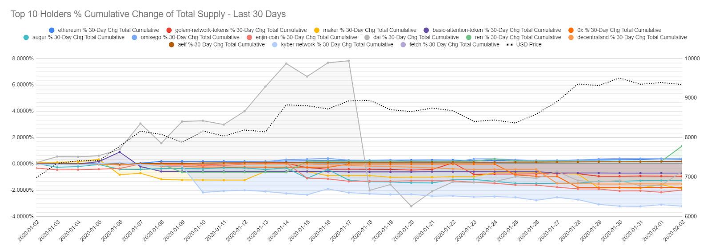
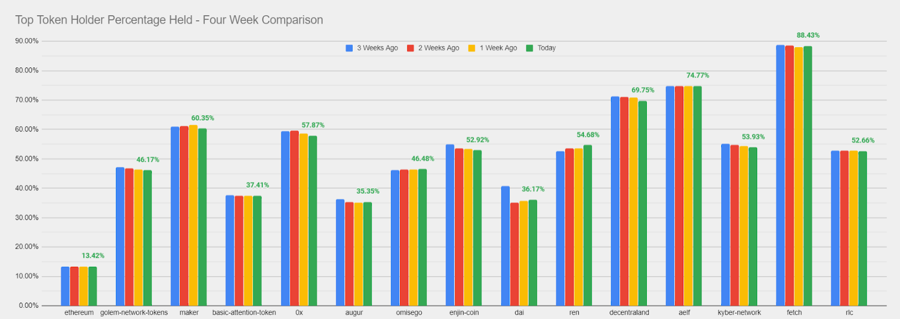

**Note: In order to enable your computer and Google Sheets documents to use Sansheets, you must be a Sanbase Pro subscriber. If you are a free user, you may still view templates made by our staff and community members. But you will need to become a Pro member for our powerful Sansheets add-on to be a tool you can use yourself.**

Whether you are a data scientist, crypto hobbyist, or simply a trader and investor with very little data background, Sansheets offers a way to create and view interactive market models using Santiment's on-chain, social and project data. With our all-in-one Spreadsheets plugin, you can run trade simulations, backtest new strategies and add context to the behavior and volatility of the crypto market. There is no need to make your own data aggregations. We've prepared the groundwork for you.

Through existing custom templates that our team and Sanfam have already created, or through your own creations, you can investigate network activity, discover market patterns, and analyze stakeholder behavior with our clean, reliable data streams for hundreds of digital assets.

Whereas our Sanbase and Sandata platforms are mainly used to provide any cryptocurrency data you may want to access at the tip of your fingertips, Sansheets allows you to make use of this data and actually form public or private strategies to backtest with the full power of Google Sheets, and use them for your own trading any way you'd like.

One of the best parts of Sansheets' integration with Google Sheets is that templates can be setup to auto-update data without any need to refresh or constantly re-input end dates for the model to pull data for. Simply end your date range with "TODAY()" and you'll receive data directly into your model as soon as it becomes available on Santiment.

The possibilities are pretty endless when it comes to what types of models can be created, and Santiment offers an array of 48 different functions to use for you to build any cryptocurrency model your heart desires. You can learn all about the Sansheets functions we have available, and how they work on our academy page: https://academy.santiment.net/sansheets/functions/

With the explanation out of the way, let's get into how to get you setup with Sansheets on. To get started and begin creating your own templates and models, follow these simple steps precisely:

## Install and activate Sansheets

1. Head over to https://docs.google.com/spreadsheets/u/0/ and ensure you are signed in with any existing Google account.
   
2. Open a Blank Google Sheets template
   
3. Go to the **Add-Ons** dropdown and click **Get Add-Ons**
   
4. You'll see a Google Sheets store open up. In the top right, you'll see a search bar. Simply enter "Santiment" here, then hit **Enter**.
   
5. You will see the "Santiment Data" app come up as a result, click on the **+FREE** button to install Sansheets to your system:
   
6. After installation of the Sansheets add-on, you should see confirmation that it was installed successfully. Go to the **Add-Ons** tab, hover over the newly created **Santiment Data** menu, and click **Enable**.
   
   
7. After a few seconds, you should see a confirmation message explaining that you are about to enable cryptocurrency data through Santiment custom functions. Click **Ok**.
   

## Create and add an API key

8. With Sansheets now enabled, you simply need to provide your API key. This key is found by going to https://sheets.santiment.net and clicking on the **account icon** at the top right of your page.
   
9. If you already have an API key active, you will see your key with a **copy button** to allow you to easily copy it. If one doesn't yet exist yet, simply click on the **Generate** button and then use the **copy button** to save it to your clipboard.
   
10. Head back to your Google Sheets page and go to Add-ons -> Santiment Data, and click on Add API Key. Paste your copied API key and click **Confirm**.
    

## The first call

11. To test out your newly and fully enabled Sansheets add-on, type in **`=SAN`** and look to see if there is a dropdown of different function options to choose from. If you see them, then you are officially ready to enter Santiment formulas and begin creating your own models!
    
12. Choose a cell and ensure there are 2-5 blank columns to the right of it (depending on the SAN formula you choose to input). You can select between any SAN formula available in the dropdown, or refer to the Sansheets academy page to find the perfect function to accomplish what you're trying to create: https://academy.santiment.net/sansheets/functions/. Once selected, enter it with an open parentheses afterwards, followed by the full name of the project's slug, a comma, then your start date as "`DATE(month,day, year)`", another comma, and your end date as "`DATE(month,day, year)`" OR "`TODAY()`" if you would like your model to auto-update to the current date. Then press enter. Eg, "`=SAN_OHLC("bitcoin",DATE(2015,2,1),TODAY())`" will give you the Open, High, Low, and Close prices of every day between February 1st, 2015 and the most recent Santiment data available.
    

Depending on how large your timeframe was, you will have to wait momentarily while seeing "Loading..." where you entered your formula. Once done, you will see the data you requested generate into the expanded rows and columns from your original cell.

Note that you may also refer to our helpful Github Sansheets function repository to find additional info on functions to pull data for any of your favorite metrics: https://github.com/santiment/google-spreadsheet-addon/blob/master/doc/sheet_functions.md

A nice feature with Sansheets that you won't see in traditional data models is the fact that you can direct it to auto-pull Santiment data on a daily basis without any action needed. Simply take a certain start date and enter it into your formula along with an end date of "`TODAY()`" and Sansheets will add an extra row of data to whatever metric you are directing Sansheets to pull from Santiment's extensive database.

You have the option to make your insights public and provide access to any of your self-made templates with other members of the Santiment Team and Sanfam to collaborate and put great minds together to create a special profitable strategy for cryptocurrency investing.

Congratulations on beginning your Sansheets adventures, and contact us at any time should you have questions or troubleshooting needs!

## Using existing Sansheets templates

When it comes to using existing Sansheets templates, many templates provided by the Santiment Team will have an "About" tab to explain the functionality. Regardless, here is a breakdown of a few of our featured "View Only" templates that we offer:

### NVT Analysis

The objective of the NVT Analysis template is to indicate how a given coin's token circulation looks at a given time compared to its market cap. Using trendlines over time on a monthly perspective, this is a great tool to indicate when markets are looking bearish to bullish.What you see here is:

1. A set of NVT columns represented by five distinct colors ranging from bearish to bullish
2. Three lines representing the high, average, and low price of each respective month
3. Subtle, colored trendlines which help calculate
4. Hashmarks on the right of the latest displayed month showing what the daily NVT values have looked like within that month over the past 10 days
   

In short, the main objective of this chart is to provide a macro look at whether the most recent month is getting enough token circulation (unique addresses exchanging tokens) to justify its current market cap.

Tips: Look at the color of the far right most column and match to the color of the five circles at the bottom left of the legend. The color of the right-most column in this above screenshot, for example, is red, and therefore would be an indication that the markets are bearish. However, pay special attention to the hashmarks that represent the recent 10 days of NVT. If they are starting to look lower on the chart, which is the case in this example (particularly the "1 Day" hashmark, representing yesterday), then NVT may be starting to see a short-term turning point. If these hashmarks are sustained, then you'll notice the color of the monthly column begin to match the levels the new days of data are indicating.

This model does have great backtest results, proving that the correlations between a given month's low, average, and high prices of a given month tend to veer toward negative with bearish signals, and undoubtedly positive when posting bullish signals.

### Historical Timing Trends

This model includes four different ways to measure the results of Bitcoin's market results based on various measurements of time (with other tokens to come in the future):

1. Day of Week - Measures Bitcoin's price performance based on the seven days of the week.
2. Month - Measures Bitcoin's price performance based on each month out of the year.
3. Time of Month - Measures Bitcoin's price performance based on the early, early-mid, mid, late-mid, and late portions of months.
4. Year - Measures Bitcoin's price performance based on each individual year.
   

Explore and use filters to find what kinds of trends may be beneficial to your trading strategies.

### Thresholds Crossed

Currently available for Bitcoin and Ethereum, the Thresholds Crossed model indicates just how many times (from a daily perspective) projects have crossed above or below different round levels historically. Getting a glance at which thresholds have been crossed most often will give you a great perspective of where support and resistance of a given project lies.

### Daily Active Address Divergence

Daily active addresses are a great way to measure network health and to get an idea of where prices may be headed based on how many daily active addresses are being created at a given time. We have a model that measures when there is a divergence between these active addresses and the movement of price.

Watch for large, grouped signals of green to identify when price is undervalued compared to the amount of daily active addresses that are being created. And conversely, look for groups of red signals to find out when price is becoming overinflated.

### Velocity Divergence

Created with the same concept in mind as daily active address divergence, velocity divergence also has some upside by measuring the amount of volume being circulated compared to the supply of a token.

As is the case with our Daily Active Addresses model, you want to look out for bunched signals of green or red to identify tops and bottoms of markets.

### Top Holders Supply

The top holders supply model provides our users with three ways to see what some key ERC-20 top holders are doing with their funds. This is a great way to get an idea of what may be foreshadowing in the markets, as these high capital holders have a great amount of leverage when it comes to what direction prices of a given project are heading next:

1. Cumulative percent change in top holders - View what the top 1, 10, or 100 holders of a given project have been doing with their holdings over the previous 30 days by viewing their percentage added and removed from their addresses during this timeframe.
2. Big moves in top holders on a given day - As opposed to viewing what the total change has been in top holder bags over the past 30 days, this view isolates only particularly large moves on a given day by these top holders.
3. Percentage held by top holders - As some tokens are less diversified than others, this model shows the percentage of tokens held by the top holder addresses of a given project, with each bar showing one of the past four weeks (green being most recent). The higher the percent of the total supply these 10 addresses hold, the more influence they have on the prices based on their own buys and sells.

### Development Activity

Projects that have consistently high development activity tend to reflect a higher degree and chance of longevity by those respective teams. Finding out when they particularly start to ramp up or wind down their rates of activity can be a great way to measure when it's a safe time to get in or bow out of an investment.

This model highlights considerably high fluctuations in development activity for some notable projects. Spotting a big spike in development activity over a particular or series of days can be a great way to find entry points.

Whatever types of metrics you are into, Sansheets is likely capable of creating the models for your area of study. You can also contact our staff, and we can see about collaborating on a project with you, as we are always interested in learning more about the markets in unique and interesting ways. Let us know if you'd like to try out Sansheets for two weeks free of charge, and we look forward to hearing your feedback!
